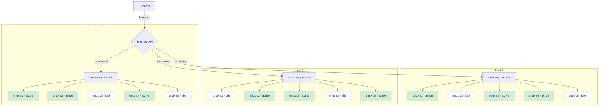

# E. Morricone Ag

> **E. Morricone Ag** (`emorr-agy`) is a Go-based Telegram bot and CLI orchestrator designed to manage, monitor, and interact with multiple `tmux` sessions running on remote machines.

---

  

---

## Project Architecture

## Features (BDD Specs)

* **Multi-Project Management**: Switch context via `/projects` to view only active `tmux` sessions relating to a specific project.
* **Standardized Session Names**: Dynamically spawn `tmux` sessions with standardized, structured names (e.g. `emorragi-data-analysis-1654172400`).
* **Real-time Status Monitoring**: Instantly query machine status via `/status` to see which sessions are **[BUSY]** or **[IDLE]**.
* **Persistence on Reboot**: Restores sessions and executes startup workflows automatically if the remote host machine reboots.
* **Granular Navigation & Interaction**: Select specific **[IDLE]** sessions and focus on them to send interactive inputs, view recent console outputs, or terminate them.

---

## Technical Stack

* **Language**: Go
* **Telegram Integration**: `go-telegram-bot-api`
* **Session Management**: Native `tmux` CLI integration with process status inference.
* **State Persistence**: Simple JSON state tracking (e.g., `~/.emorragi_state.json`) for session restoration.
