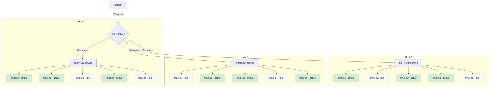

## Architettura del Progetto

# Progetto:  E. Morricone Ag

**Concept:** Un bot per Telegram (CLI: `emorr-agy`), scritto in Go, che agisce come un'interfaccia di controllo per le sessioni `tmux` in esecuzione su una macchina remota. Il repository del progetto sarà `Palladius/emorr-agy`.

## Links
GH repo: TODO
agy SDK: TODO

---

## User Stories / BDD

### Feature: Gestione Multi-Progetto
- **Scenario:** L'utente lavora su più progetti contemporaneamente.
- **When:** L'utente invia il comando `/projects` al bot.
- **Then:** Il bot mostra un elenco di progetti attivi, permettendo all'utente di "switchare" il contesto e visualizzare solo le sessioni `tmux` relative a quel progetto.

### Feature: Standardizzazione Nomi Sessioni
- **Scenario:** Creare una nuova sessione per un task specifico.
- **When:** L'utente avvia un nuovo processo tramite il bot.
- **Then:** La sessione `tmux` viene creata con un nome standardizzato, es: `emorragy-data-analysis-1654172400`.

### Feature: Visualizzazione Stato Sessioni
- **Scenario:** L'utente vuole un colpo d'occhio sulle attività della macchina.
- **When:** L'utente invia `/status` nel contesto di un progetto.
- **Then:** Il bot elenca le sessioni, indicando per ciascuna se è **[BUSY]** (in esecuzione) o **[IDLE]** (in attesa di input utente).

### Feature: Persistenza al Riavvio
- **Scenario:** Il computer host viene riavviato.
- **Given:** C'erano 5 sessioni `tmux` attive prima del riavvio.
- **When:** Il servizio `emorragy` parte allo startup del sistema.
- **Then:** Il servizio tenta di ripristinare le 5 sessioni precedenti, rieseguendo i comandi iniziali.

### Feature: Interazione e Navigazione
- **Scenario:** L'utente vuole passare a una sessione specifica.
- **When:** L'utente clicca il bottone "Focus" sotto una sessione [IDLE].
- **Then:** Il bot presenta opzioni contestuali come "Invia comando", "Visualizza ultimi output" o "Termina sessione".

---

## Stack Tecnico
- **Linguaggio:** Go
- **Libreria Telegram:** `go-telegram-bot-api`
- **Gestione Sessioni:** `tmux` CLI + logica per inferire stato BUSY/IDLE.
- **Persistenza:** Un semplice file di stato (es. `~/.emorragy_state.json`) per salvare le sessioni da ripristinare.
