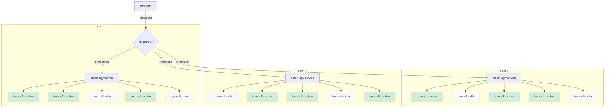

## Project Architecture

# Project: E. Morricone Ag

**Concept:** A Telegram bot (CLI: `emorr-agy`), written in Go, which acts as a control interface for `tmux` sessions running on a remote machine. The project repository will be `Palladius/emorr-agy`.

## Links
GH repo: TODO
agy SDK: TODO

---

## User Stories / BDD

### Feature: Multi-Project Management
- **Scenario:** The user works on multiple projects simultaneously.
- **When:** The user sends the `/projects` command to the bot.
- **Then:** The bot shows a list of active projects, allowing the user to "switch" contexts and view only the `tmux` sessions related to that project.

### Feature: Standardized Session Names
- **Scenario:** Create a new session for a specific task.
- **When:** The user starts a new process via the bot.
- **Then:** The `tmux` session is created with a standardized name, e.g., `emorragi-data-analysis-1654172400`.

### Feature: Session Status View
- **Scenario:** The user wants a quick overview of the machine's activities.
- **When:** The user sends `/status` in the context of a project.
- **Then:** The bot lists the sessions, indicating for each whether it is **[BUSY]** (running) or **[IDLE]** (waiting for user input).

### Feature: Persistence on Reboot
- **Scenario:** The host computer is restarted.
- **Given:** There were 5 active `tmux` sessions before the reboot.
- **When:** The `emorragi` service starts up with the system.
- **Then:** The service attempts to restore the 5 previous sessions by re-running the initial commands.

### Feature: Interaction and Navigation
- **Scenario:** The user wants to switch to a specific session.
- **When:** The user clicks the "Focus" button under an [IDLE] session.
- **Then:** The bot presents context options such as "Send command", "View latest output", or "Terminate session".

---

## Technical Stack
- **Language:** Go
- **Telegram Library:** `go-telegram-bot-api`
- **Session Management:** `tmux` CLI + logic to infer BUSY/IDLE status.
- **Persistence:** A simple state file (e.g., `~/.emorragi_state.json`) to save sessions to be restored.
